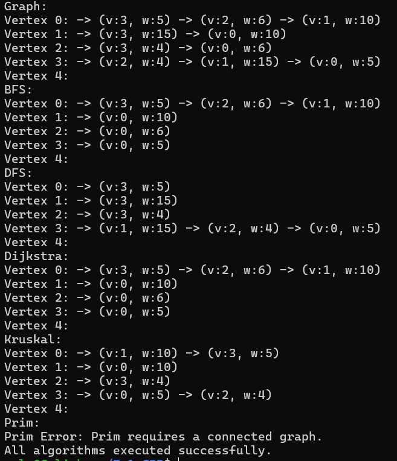

# Ex1 C++
## Implementing algorithms on graphs using a adjacency list

This project implements an undirected weighted graph using an adjacency list representation in C++.
It also includes several classical graph algorithms built on top of this structure.

## Project structure
* Graph - reprasents the graph by adjacency list. (Graph.hpp, Graph.cpp)
* Algorithms - contains BFS, DFS, Dijkstra, Prim, and Kruskal.(Algorithms.hpp, Algorithms.cpp)
* DataStructures - Data structures needed for the algorithms. (Datastructures.hpp, DataStructures.cpp)
* Test - verifies the correctness of all implemented algorithms.(test.cpp)
* Main -  entry point to test the algorithms.(main.cpp)
* Makefile - This project includes a simple Makefile to compile all source files easily.

Below is an example of the output when running the `main` program with a sample graph.

It shows:

• The original graph as an adjacency list  
• The resulting trees from BFS and DFS  
• Dijkstra’s shortest paths  
• Kruskal’s MST  
• An error when running Prim on a disconnected graph

## Example Output:



##  How to Compile the Project

This project includes a `Makefile` to simplify the build and testing process.  
Below are the available commands and what they do:

##  Compile and build the main program

```bash
make Main
```
This command compiles all the main source files:
- `main.cpp`
- `Graph.cpp`
- `Algorithms.cpp`
- `DataStructures.cpp`

It produces an executable file named `Main`, which runs the program with a sample graph and executes all algorithms (BFS, DFS, Dijkstra, etc.).

---

##  Compile and run the unit tests
```bash
make test
```

This command compiles the test file `test.cpp` along with the graph source files.  
It creates a `test` executable that can be run to verify the correctness of the algorithms.

To run the tests after building:

```bash
./test
```

Or simply:

```bash
make run-tests
```

This will compile the tests, run them, and print whether they passed or failed.

---

### Check for memory leaks using Valgrind

```bash
make valgrind
```

This command runs the compiled main program (`Main`) using **Valgrind**, a tool for detecting memory leaks and memory errors.  
It uses strict flags and writes the detailed report to a file named `valgrind-out.txt`.

You can view the report with:

```bash
cat valgrind-out.txt
```
Or you can see the report by using this comment:
```bash
explorer.exe .
```
after you using:
make valgrind comment.

---

## Clean compiled files

```bash
make clean
```

This removes:
- The main executable `Main`
- The test executable `test`
- Any `.o` files (if created)
- The Valgrind log file `valgrind-out.txt`

This is useful to start with a fresh build or after you're done testing.

---

These commands make it easy to build, test, debug, and maintain your project without needing to type long compiler commands.


